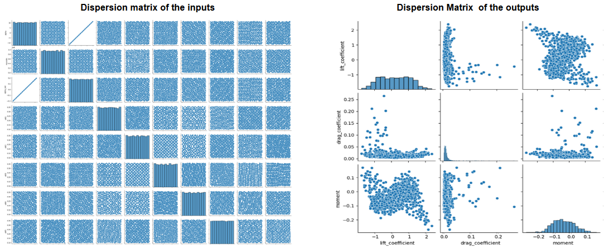
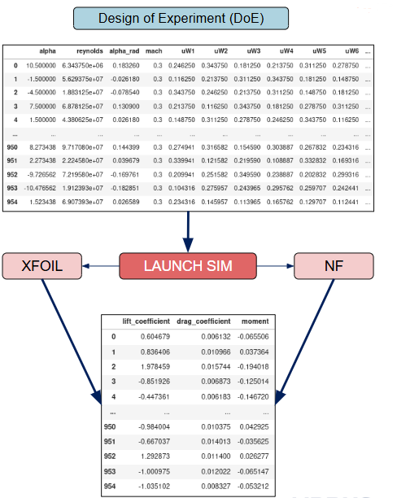
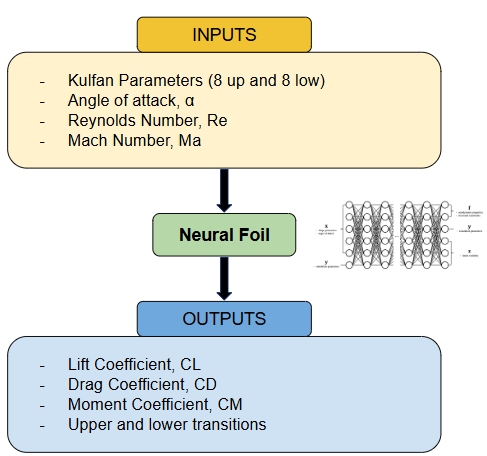
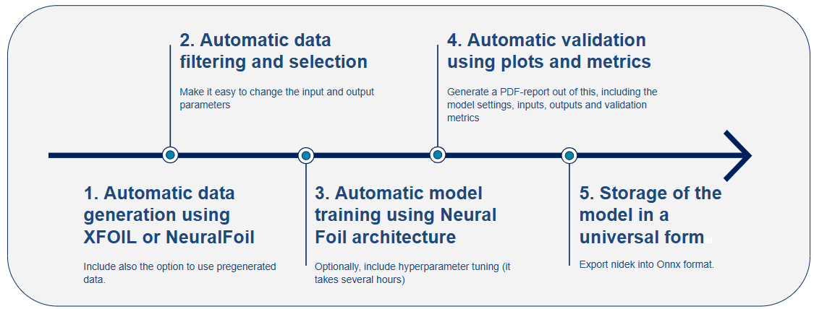
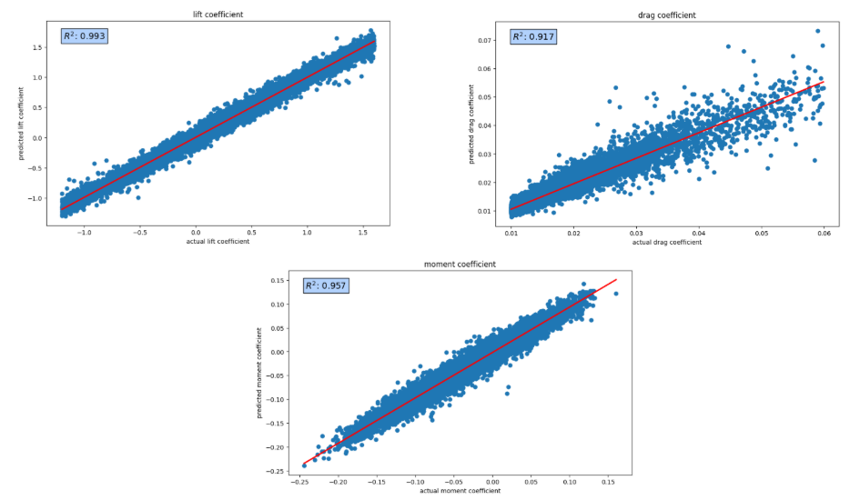
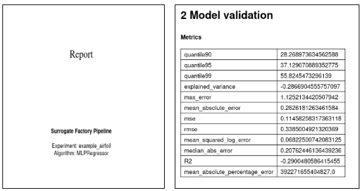

# Surrogate-Based Aerodynamic Pipeline for Airfoil Design of Experiments (DoE)

This use case demonstrates the implementation of an **automated aerodynamic Design of Experiments (DoE)** pipeline developed using **Surrogate Factory (SF)** within the **Flight Physics Department** at Airbus Defence and Space (ADS).  
The pipeline generates and analyses aerodynamic coefficients (`Cl`, `Cd`, `Cm`) for parametrized **airfoil geometries** defined by **Kulfan coefficients (CST)**, combining data-driven modeling and high-fidelity aerodynamic analysis tools such as **XFOIL** and **NeuralFoil**.

---

## Objective

The goal of this pipeline is to **create and evaluate a design space** for airfoil configurations based on **18 Kulfan parameters**, coupled with aerodynamic conditions (`α`, `Re`, `Mach`).  
By leveraging **Surrogate Factory**, the workflow enables:
- Automatic creation of the **DoE**,
- Scaling and filtering of input parameters,
- Aerodynamic data generation through **XFOIL** or **NeuralFoil**, and
- Post-processing and reporting of key aerodynamic metrics.

---

## Design of Experiments (DoE)

The **Design of Experiments** is constructed using **20 bounded independent variables**, each defining the aerodynamic and geometric space of the study.

| Type | Variable | Description | Units | Range / Bounds |
|:--|:--|:--|:--|:--|
| **Flow Conditions** | `α` | Angle of attack | deg | -11.5 ≤ α ≤ +11.5 |
| | `Re` | Reynolds number | – | [1e6, 20e6] |
| **Geometry Parameters** | `Kulfan_1` … `Kulfan_18` | CST shape coefficients | – | [-0.2, +0.2] |
| **Constants** | `Mach` | Mach number | – | 0.3 |
| | `α_rad` | Angle of attack (radians) | rad | Derived from α |

Each configuration in the DoE represents a unique combination of these variables, forming the basis for aerodynamic analysis and model training.

  
  

---

## Data Processing and Filtering

1. **Scaling**  
   All input variables are normalized according to their respective bounds to ensure consistent magnitude during model training and evaluation.

2. **Filtering**  
   Data points are constrained to physically meaningful limits:  
   \[
   α ∈ [-11.5°, +11.5°]
   \]  
   ensuring the aerodynamic regime remains within the valid operating range.

3. **Generation Mode**  
   Aerodynamic coefficients are computed using either:  
   - **XFOIL:** low-fidelity, physics-based solver.  
   - **NeuralFoil:** surrogate-based solver replicating XFOIL predictions with improved computational speed.

---
 

## Aerodynamic Outputs

The DoE produces aerodynamic coefficients for each configuration:

| Output | Description | Units |
|:--|:--|:--|
| `Cl` | Lift coefficient | – |
| `Cd` | Drag coefficient | – |
| `Cm` | Pitching moment coefficient | – |

These outputs form the ground truth dataset for later surrogate modeling or optimization steps.

---

## Pipeline Architecture

The workflow implemented in **Surrogate Factory** consists of the following stages:

| Stage | Description |
|:--|:--|
| **1. DoE Generation** | Creation of the parameter space from 20 bounded variables (α, Re, 18 Kulfan coefficients, Mach, α_rad). |
| **2. Data Scaling & Filtering** | Normalization of inputs and filtering by α limits. |
| **3. Data Generation** | Calculation of `Cl`, `Cd`, and `Cm` via XFOIL or NeuralFoil. |
| **4. Model Definition** | Construction of a surrogate model (optional MLP, KRR, or NeuralFoil architecture). |
| **5. Model Training & Validation** | Training using GPU acceleration and validation through statistical and visual methods. |
| **6. Storage & Reporting** | Consolidation of results, model parameters, and validation metrics into a structured final report. |

  

---

## Validation and Surrogate Integration

The generated dataset can be used directly to train surrogate models within **Surrogate Factory**.  
Each model can map subsets of the DoE as:

\[
f: (\alpha, Re, Kulfan_1, ..., Kulfan_{18}) \longrightarrow (C_l, C_d, C_m)
\]

Validation is performed via:
- **Statistical metrics:** Mean, Std, IQR, Skewness, Kurtosis.  
- **Error distributions:** residuals and absolute error histograms.  
- **Visualization:** cumulative and parity plots.

The following plots illustrate sample distributions of aerodynamic coefficients generated from the DoE:

  

These results demonstrate consistent aerodynamic trends and validate the correctness of the DoE filtering and generation strategy.

---

## Storage and Report Generation

Once validated, all results are consolidated within the **Storage & Integration Management (IM)** module, which automatically:
- Stores the generated datasets and trained models (`.pkl`, `.onnx`),
- Collects metadata, model parameters, and validation metrics,
- Produces a comprehensive **final report** summarizing aerodynamic trends and surrogate performance.

  

---

## Conclusions

This pipeline demonstrates a **fully automated aerodynamic DoE generation and analysis framework** using **Surrogate Factory**.  
It successfully integrates **parametric airfoil geometry (Kulfan coefficients)** with aerodynamic solvers (XFOIL / NeuralFoil) to:
- Create a scalable, bounded design space,  
- Automate dataset creation and validation, and  
- Enable future surrogate modeling and optimization studies within Flight Physics.

The methodology can be directly extended to **3D aerodynamic surfaces** and **MDOA workflows**, serving as a foundation for next-generation surrogate-based aerodynamic design.

---

## Author

**Marta A. Martín**  
Flight Physics – Technology Integration  
Airbus Defence and Space (Getafe, Spain)
